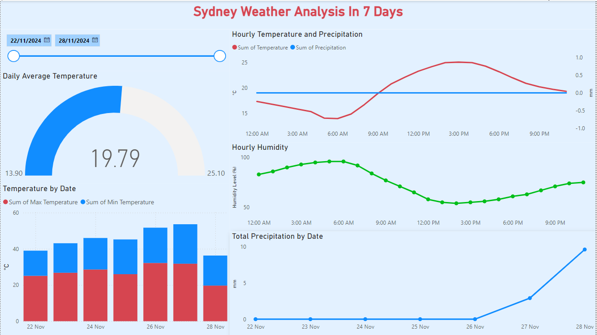

# Airflow-Weather-Data-Pipeline

## Overview

This project automates the process of fetching, transforming, and loading weather data from the Open-Meteo API into **Google BigQuery** for analysis and forecasting. The pipeline retrieves both **hourly** and **daily** weather data for Sydney, Australia, including variables such as temperature, wind speed, humidity, and precipitation. The project uses **Python**, **Pandas**, **Apache Airflow**, and **Google Cloud Platform** (GCP) technologies.

### **Key Features**
- **Data Collection**: Fetches real-time weather data from the Open-Meteo API.
  - **Hourly data** includes temperature, wind speed, precipitation, and relative humidity.
  - **Daily data** includes maximum/minimum temperature, total precipitation, and wind direction.
  
- **Data Transformation**: 
  - Converts raw data into structured **Pandas DataFrames**.
  - Standardizes and formats the time column into the `datetime` format, ensuring compatibility with **BigQuery**.

- **Data Storage**:
  - Processes the data and stores it in **Google BigQuery** in structured tables.
  - The data is divided into **hourly** and **daily** tables with appropriate schemas.

- **Automation & Scheduling**:
  - Orchestrates the pipeline using **Apache Airflow**.
  - Schedules the ETL pipeline to run daily, ensuring data is up-to-date with the latest forecasts.

- **Error Handling**:
  - Includes error handling and logging to manage failures during any part of the pipeline (fetch, parse, or load). The process ensures that incomplete or erroneous data is not uploaded.

---

## Technologies Used

- **Python**: For API interaction and data processing.
- **Pandas**: For transforming and handling weather data as DataFrames.
- **Open-Meteo API**: For fetching weather forecast data.
- **Google BigQuery**: Cloud-based data warehouse for storing the processed weather data.
- **Apache Airflow**: For workflow orchestration and scheduling the ETL pipeline.
